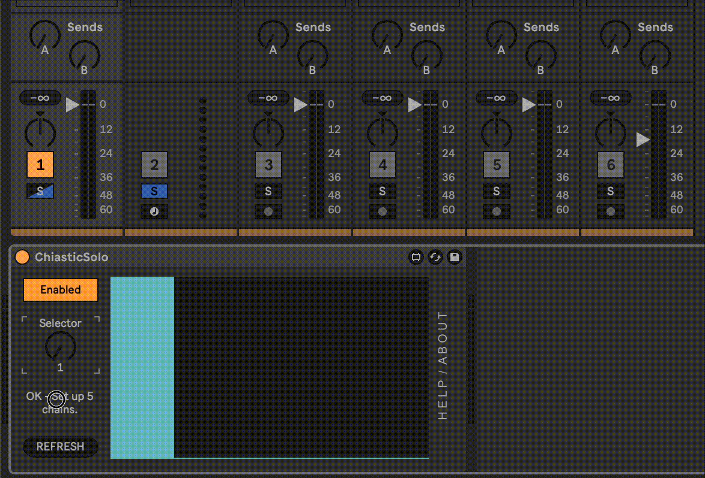

# Chiastic Solo

Chiastic Solo is a Max for Live device that lets you control which track in a group or rack is soloed. It can handle up to 32 chains / tracks.



I had the idea to make this while working on an album project. I had a Live project, with a track in the project for each song on the album. I was at the stage where I was balancing the different songs to make sure they sounded cohesive. I was finding the normal solo controls to be too distracting, and wished for a knob to control which track was soloed, hence the idea for this device.

## Installation

[Download the .amxd file from the latest release](https://github.com/zsteinkamp/m4l-ChiasticSolo/releases) or clone this repository, and drag the `ChiasticSolo.amxd` device into a track in Ableton Live.

### LIVE 12 USERS TAKE NOTE!

Live 12 changed the UI behavior when a track is soloed to highlight or focus that track. This makes using ChiasticSolo impossible. To fix it, you can add this line to your `options.txt` file:

```
-NoHighlightOnSolo
```

(the leading hypen '-' is essential).

To find where to create the `options.txt` file for your operating system, [read this article on options.txt from Ableton](https://help.ableton.com/hc/en-us/articles/6003224107292-Options-txt-file).

## Changelog

- 2025-09-18 [v4](https://github.com/zsteinkamp/m4l-ChiasticSolo/releases/download/v4/ChiasticSolo-v4.amxd) - Adds a toggle that lets you choose Solo or Mute. This allows Allows the Selector to be mapped to a MIDI controller or controlled by a Macro dial in a rack. Fixed a bug that prevented child track detection if placed inside a rack.
- 2025-09-16 [v3](https://github.com/zsteinkamp/m4l-ChiasticSolo/releases/download/v3/ChiasticSolo-v3.amxd) - Allows the Selector to be mapped to a MIDI controller or controlled by a Macro dial in a rack. Fixed a bug that prevented child track detection if placed inside a rack.
- 2024-10-29 [v2](https://github.com/zsteinkamp/m4l-ChiasticSolo/releases/download/v2/ChiasticSolo-v2.amxd) - Add non-blocking telemetry ping on load. Does not send any identifying information, only the plugin name, the local computer name, type of computer, and CPU type. I just want to see which plugins are used the most.
- 2024-05-22 [v1](https://github.com/zsteinkamp/m4l-ChiasticSolo/releases/download/v1/ChiasticSolo-v1.amxd) - Initial release.

## Usage

Add this device to the parent track in a group or immediately after an Instrument Rack or Audio Effect Rack device. If you need to move it or if you add subtracks / chains, press the `REFRESH` button to have it detect the chains again.

Use the `Selector` knob to control which track or chain is soloed.

Press the `Enabled` button to toggle the device off to un-solo all tracks.

Use the `Solo / Mute` buttons to choose whether Chiastic Solo uses Solo or Mute to do its thing.

## FAQ

### I can't get it to work with my instrument / effect rack! Halp!?

Ensure you have put the Chiastic Solo device _after_ the rack, then press the `Refresh` button.

## TODO

- ...
