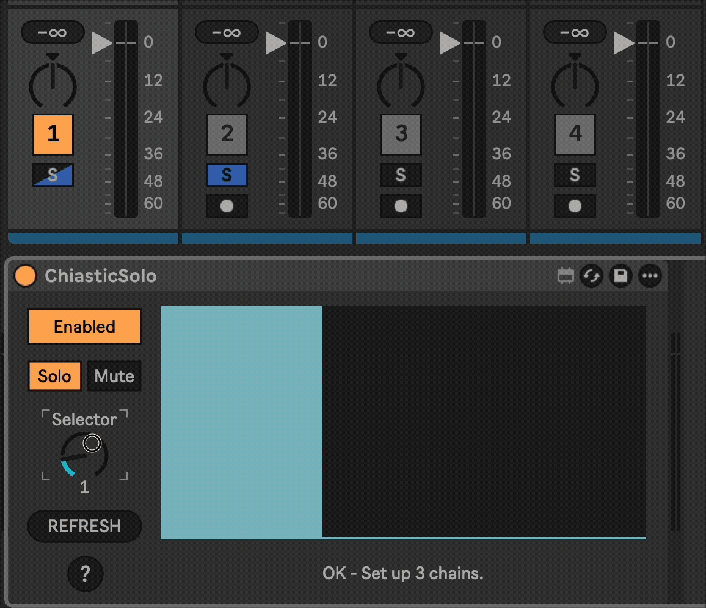

# Chiastic Solo

Chiastic Solo is a Max for Live device that lets you control which track in a group or rack is soloed. It can handle up to 32 chains / tracks.

I had the idea to make this while working on an album project. I had a Live project, with a track in the project for each song on the album. I was at the stage where I was balancing the different songs to make sure they sounded cohesive. I was finding the normal solo controls to be too distracting, and wished for a knob to control which track was soloed, hence the idea for this device.

## Installation

[Download the .amxd file from the latest release](https://github.com/zsteinkamp/m4l-ChiasticSolo/releases) or clone this repository, and drag the `ChiasticSolo.amxd` device into a track in Ableton Live.

## Changelog

- 2024-05-22 [v1](https://github.com/zsteinkamp/m4l-ChiasticSolo/releases/download/v3/ChiasticSolo.v3.amxd) - Initial release.

## Usage

Add this device to the parent track in a group or immediately after an Instrument Rack or Audio Effect Rack device. If you need to move it or if you add subtracks / chains, press the `REFRESH` button to have it detect the chains again.

Use the `Selector` knob to control which track or chain is soloed.

Press the `Enabled` button to toggle the device off to un-solo all tracks.

## TODO

- ...

## Contributing

I'd love it if others extended this device. If you would like to contribute, simply fork this repo, make your changes, and open a pull request and I'll have a look.
